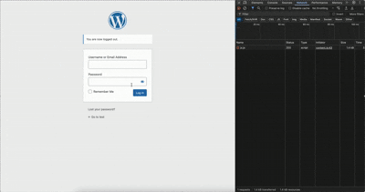

# Secure Login Encryptor

**Contributors:** Lungdsuo Mozhui  
**Tags:** security, login, encryption, secure login, encrypt, rsa, jsencrypt  
**Requires at least:** 5.0  
**Tested up to:** 6.5  
**Stable tag:** 1.1.0  
**License:** GPLv2 or later  
**License URI:** [https://www.gnu.org/licenses/gpl-2.0.html](https://www.gnu.org/licenses/gpl-2.0.html)

A simple and effective plugin to add a layer of JavaScript-based encryption to your default WordPress login page.

---

## Description

The **Secure Login Encryptor** plugin enhances the security of your WordPress login process by encrypting user credentials (username and password) directly in the browser before they are sent to the server.

This is achieved using a public/private key pair (RSA encryption). On the login page, a public key is used to encrypt the data via JavaScript. This encrypted data is then sent to the server, where a secret private key decrypts it just before WordPress performs the standard authentication. This ensures that the username and password are never transmitted in plain text.

### Key Features

- **Asymmetric RSA Encryption:** Uses a 2048-bit public/private key pair for strong encryption.
- **Client-Side Encryption:** Credentials are encrypted in the user's browser, protecting them while in transit.
- **Automatic Key Generation:** A unique key pair is generated and stored securely in your database upon plugin activation.
- **Self-Contained:** All required scripts are bundled with the plugin, so there are no external dependencies or calls to third-party CDNs.
- **Seamless Integration:** Hooks directly into the WordPress authentication flow without altering the user experience.

> **IMPORTANT:** This plugin is an additional security measure and **NOT** a replacement for a valid SSL certificate. Your site must be served over **HTTPS** to be truly secure.

---

## Demonstration

For a visual walkthrough of how the plugin works, please see the included video demonstration:  

---

## Installation

1. Download the plugin folder `secure-login-encryptor`.
2. Ensure the folder contains the following files:
    - `secure-login-encryptor.php`
    - `secure-login-script.js`
    - `jsencrypt.min.js`
    - Your video file (e.g., `demo.mp4`)
    - `readme.txt`
3. Upload the entire `secure-login-encryptor` folder to the `/wp-content/plugins/` directory on your server.
4. Navigate to the 'Plugins' menu in your WordPress admin dashboard.
5. Find the "Secure Login Encryptor" plugin and click 'Activate'.

Upon activation, the plugin will automatically generate the required public and private keys. Your login form is now protected.

---

## Frequently Asked Questions

### Is this a replacement for SSL (HTTPS)?

**No, absolutely not.** An SSL certificate encrypts all traffic between the user's browser and your server. This plugin specifically encrypts the user credentials *within* that already secure tunnel. You should always use HTTPS on your website, especially on login pages. Think of this plugin as an extra layer of defense.

### Where are the encryption keys stored?

The public and private keys are stored in the `wp_options` table in your WordPress database.

### What happens if I deactivate the plugin?

If you deactivate the plugin, the encryption/decryption process is removed, and your login form will revert to the default WordPress behavior. The keys will remain in your database in case you decide to reactivate it later.

### How can I verify it's working?

1. Log out of your site.
2. Open your browser's Developer Tools (usually by pressing F12).
3. Go to the "Network" tab.
4. Enter your username and password and click "Log In".
5. Find the `wp-login.php` request in the network log. Look at the "Payload" or "Request Data". You will see that the `log` (username) and `pwd` (password) values are long, encrypted strings instead of plain text.

---

## Changelog

### 1.0.0 - July 26, 2025

- Initial release of the plugin.
- Functionality: Implemented client-side encryption and server-side decryption of login credentials.

